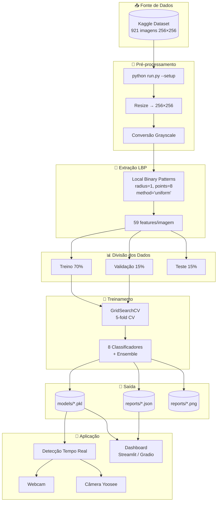

# Human Recognition Project

<p align="center">
  <strong>Projeto de Visão Computacional para o Reconhecimento de Silhueta Humana em Tempo Real</strong>
</p>

<p align="center">
  
  
  
  
  
</p>

---

## 📑 Sumário

- [Sobre o Projeto](#-sobre-o-projeto)
- [Local Binary Patterns (LBP)](#-local-binary-patterns-lbp)
- [Fluxo de Dados](#-fluxo-de-dados)
- [Origem do Dataset](#-origem-do-dataset)
- [Começando](#-começando)
  - [Pré-requisitos](#pré-requisitos)
  - [Instalação](#instalação)
- [Estrutura do Projeto](#-estrutura-do-projeto)
- [Funcionalidades](#-funcionalidades)
- [Dashboard Interativo](#-dashboard-interativo)
  - [Tab 1: Métricas Gerais](#tab-1--métricas-gerais)
  - [Tab 2: Métricas por Fold](#tab-2--métricas-por-fold)
  - [Tab 3: Hiperparâmetros e Métricas](#tab-3--hiperparâmetros-e-métricas)
  - [Tab 4: Detecção em Tempo Real](#tab-4--detecção-em-tempo-real)
  - [Tab 5: Análise Visual](#tab-5--análise-visual)
  - [Tab 6: Config/Sobre](#tab-6--configsobre)
- [Como Usar](#-como-usar)
- [Integração com Câmera Yoosee](#-integração-com-câmera-yoosee)
- [Solução de Problemas](#-solução-de-problemas)
- [Resultados Esperados](#-resultados-esperados)
- [Licença](#-licença)

---

## 📋 Sobre o Projeto

Este projeto implementa um sistema completo de reconhecimento de silhueta humana utilizando técnicas clássicas de Visão Computacional e Machine Learning. O sistema é capaz de:

- Treinar múltiplos classificadores usando características LBP (Local Binary Patterns)
- Detectar presença humana em tempo real via webcam ou câmera IP Yoosee
- Aplicar 6 filtros criativos diferentes para visualização estilizada
- Visualizar métricas detalhadas em dashboard interativo com Gradio
- Processamento paralelo para otimização de performance

---

## 🎯 Local Binary Patterns (LBP)

### O que é LBP?

O **Local Binary Patterns (LBP)** é um descritor de textura local ampliamente utilizado em visão computacional e reconhecimento de padrões. Criado por Ojala et al. (1996), o LBP é caracterizado por sua eficiência computacional e robustez a variações de iluminação monotônica, tornando-o ideal para aplicações de detecção em tempo real.

### Como Funciona

O algoritmo LBP opera em três etapas principais:

**1. Vizinhança Circular**
Para cada pixel da imagem, o LBP considera os pixels vizinhos dispostos em um círculo de raio `R`. O número de vizinhos é definido por `N` pontos.

**2. Comparação Binária**
Para cada vizinho:
- Se o valor do vizinho ≥ pixel central → atribui **1**
- Se o valor do vizinho < pixel central → atribui **0**

**3. Código Binário**
Os bits são concatenados formando um número binário de N bits, convertido para decimal. Este valor rotula o pixel central.

#### Exemplo Visual

```
Vizinhança 3×3 (R=1, N=8):

[85  32  26]      Pixel central: 50
[61  50  9]  →   Threshold: vizinho ≥ 50 = 1
[78  12  65]     Resultado: 11010010 (decimal: 210)
```

### Padrões Uniformes

Para reduzir a dimensionalidade, o projeto utiliza o método **"uniform"**:

- Conta-se o número de transições 0→1 ou 1→0 no padrão binário
- Apenas padrões com **≤ 2 transições** são considerados "uniformes"
- Padrões não-uniformes são agrupados em um único bin

| Parâmetro | Valor no Projeto | Descrição |
|-----------|------------------|------------|
| `radius` | 1 | Raio da vizinhança circular |
| `n_points` | 8 | Número de pontos na vizinhança |
| `method` | "uniform" | Método de quantização |
| **Features** | **59** | n_points + 2 = 8 + 2 = 10 bins |

### Por que LBP para Detecção de Silhueta?

A detecção de silhueta humana se beneficia do LBP porque:

1. **Invariância a Iluminação**: Mudanças monotônicas de brilho não afetam o padrão LBP, pois apenas a relação de ordem entre pixels importa.

2. **Descrição de Textura**: Silhuetas humanas possuem padrões de textura característicos que o LBP captura eficientemente.

3. **Baixo Custo Computacional**: A extração é rápida, permitindo processamento em tempo real (~30 FPS na webcam).

4. **Robustez**: O histograma final é tolerante a pequenas translações e rotações.

### Implementação no Projeto

O código está localizado em `src/feature_extractor.py`:

```python
from skimage.feature import local_binary_pattern

lbp = local_binary_pattern(
    image,          # Imagem em escala de cinza
    n_points=8,      # 8 vizinhos
    radius=1,       # raio = 1
    method='uniform'
)

# Histograma normalizado = vetor de características (59 features)
hist = np.histogram(lbp, bins=np.arange(0, 61))[0]
hist_norm = hist / (hist.sum() + 1e-6)
```

### Paralelização

A extração de features é paralelizada usando `joblib.Parallel`:

```python
results = Parallel(n_jobs=-1, prefer="processes")(
    delayed(self._extract_single)(img_path) 
    for img_path in image_paths
)
```

| Componente | Implementação |
|------------|---------------|
| Extração LBP | `joblib.Parallel` com todos os cores |
| Speedup esperado | 2-4x em máquinas multi-core |

### Vantagens e Desvantagens

| Vantagens | Desvantagens |
|-----------|---------------|
| Invariância a iluminação | Sensível a rotações significativas |
| Baixo custo computacional | Pode perder informações em escalas muito diferentes |
| Boa descrição de texturas | Requer imagens com contraste suficiente |
| Histograma compacto (59 features) | Não captura informação espacial global |

---

## 🔄 Fluxo de Dados



---

## 📦 Origem do Dataset

### Human Detection Dataset

**Fonte:** [Kaggle - constantinwerner/human-detection-dataset](https://www.kaggle.com/datasets/constantinwerner/human-detection-dataset)

### Descrição

O dataset utilizado neste projeto é o **Human Detection Dataset**, um conjunto de imagens públicas desenvolvido para tarefas de classificação binária de detecção humana.

| Característica | Descrição |
|----------------|-----------|
| **Total de Imagens** | 921 imagens |
| **Resolução** | 256 × 256 pixels |
| **Formato** | PNG (escala de cinza e RGB) |
| **Classes** | 2 (binário) |
| **Licença** | CC0 - Domínio Público |

### Estrutura de Classes

```
human-detection-dataset/
├── 0/                    # Classe: Sem Humano
│   ├── image_001.png
│   ├── image_002.png
│   └── ... (imagens de cenas vazias, objetos, backgrounds)
│
└── 1/                    # Classe: Com Humano
    ├── image_001.png
    ├── image_002.png
    └── ... (imagens contendo silhuetas/pessoas)
```

| Classe | Descrição | Exemplos |
|--------|-----------|----------|
| **0 (no_human)** | Cenas sem presença humana | Ambientes vazios, objetos isolados, paisagens, interiores |
| **1 (human)** | Cenas com presença humana | Pessoas completas, silhuetas, grupos |

### Distribuição dos Dados

O dataset é dividido utilizando estratificação para manter o balanceamento:

| Conjunto | Proporção | Quantidade (~) |
|----------|-----------|----------------|
| Treino | 70% | ~645 imagens |
| Validação | 15% | ~138 imagens |
| Teste | 15% | ~138 imagens |

### Justificativa de Escolha

1. **Dataset Público**: Disponível no Kaggle, sem restrições de uso acadêmico
2. **Bem Documentado**: Metadados claros sobre coleta e anotação
3. **Tamanho Adequado**: Suficiente para treinamento, pequeno para iteração rápida
4. **Balanceamento**: Distribuição aproximadamente equilibrada entre classes
5. **Variabilidade**: Diversidade de cenários, iluminação e poses

---

## 🚀 Começando

### Pré-requisitos
- Python 3.9+
- Webcam ou Câmera IP Yoosee
- Conta no Kaggle (para download do dataset)

### Instalação

1. Clone o repositório:
```bash
git clone https://github.com/seu-usuario/human_recognition.git
cd human_recognition
```

2. Instale as dependências:
```bash
pip install -r requirements.txt
```

3. Configure as variáveis de ambiente:

Crie um arquivo `.env` na raiz do projeto:

```env
# Credenciais Kaggle (obrigatório para download do dataset)
KAGGLE_USERNAME=seu_usuario_kaggle
KAGGLE_KEY=sua_chave_kaggle

# Configurações da Câmera Yoosee
YOOSEE_IP=ip.da.camera.aqui (ou busque dinamicamente)
YOOSEE_PORT=554 (554 por padrão)
YOOSEE_USERNAME=admin
YOOSEE_PASSWORD=sua_senha
YOOSEE_STREAM=onvif1 (exemplo)
```

---

## 📂 Estrutura do Projeto

```
human_recognition/
├── .env                      # Variáveis de ambiente
├── .gitignore                # Arquivos ignorados pelo git
├── requirements.txt          # Dependências Python
├── packages.txt              # Dependências do sistema (HF Spaces)
├── README.md                 # Este arquivo
├── AGENTS.md                 # Instruções para agentes
├── LICENSE                   # Licença MIT
├── run.py                    # Script principal
├── app.py                    # Ponto de entrada (HF Spaces)
├── dashboard_streamlit.py  # Dashboard Streamlit (6 tabs)
├── dashboard_gradio.py    # Dashboard Gradio (6 tabs)
├── gradio.py                 # Dashboard Gradio (6 tabs)
│
├── data/                     # Dados do projeto
│   ├── raw/                  # Dataset original
│   └── processed/            # Dados processados
│
├── models/                   # Modelos treinados
│   ├── model_*.pkl           # Modelos básicos
│   └── best_model_*.pkl      # Melhor modelo
│
├── reports/                  # Relatórios e figuras
│   ├── model_comparison_*.json  # Resultados com métricas por fold
│   └── *.png                 # Gráficos e matrizes de confusão
│
├── src/                      # Código fonte
│   ├── __init__.py
│   ├── config.py             # Configurações
│   ├── data_loader.py        # Carregamento do dataset
│   ├── feature_extractor.py  # Extração LBP (paralelizado)
│   ├── train.py              # Treinamento básico (RF) + GridSearchCV
│   ├── train_advanced.py     # Treinamento avançado (paralelizado)
│   ├── model_registry.py     # Registro de modelos + cv_fold_metrics
│   ├── ensemble.py           # Voting/Stacking ensembles
│   ├── real_time_detector.py # Detecção em tempo real
│   ├── yoosee_camera.py      # Integração com câmera Yoosee
│   └── utils.py              # Utilitários
│
└── tools/                    # Ferramentas auxiliares
    ├── find_yoosee_ip.py     # Scanner para encontrar câmera
    ├── test_yoosee_connection.py
    ├── test_digest_auth.py
    ├── rtsp_client.py        # Cliente RTSP com Digest Auth
    ├── rtsp_to_mjpeg.py      # Proxy RTSP→HTTP (PyAV)
    └── rtsp_gateway.py       # Gateway FFmpeg
```

---

## 🎯 Funcionalidades

### 1. Pipeline de Machine Learning
- **Dataset**: Human Detection Dataset (Kaggle) com 921 imagens 256x256
- **Divisão**: 70% treino / 15% validação / 15% teste
- **Extração de características**: LBP (Local Binary Patterns) com 59 features
- **Validação Cruzada**: 5-fold CV com Grid Search de hiperparâmetros
- **Métricas**: Acurácia, Precisão, Recall, F1-Score, AUC-ROC, Matriz de Confusão
- **Métricas por Fold**: Captura detalhada de cada fold da validação cruzada
- **Seleção de Modelo**: Configurável via `--selection-metric` (accuracy, f1_score, precision, recall)

### 2. Paralelização (Otimização de Performance)

| Componente | Implementação |
|------------|---------------|
| Extração LBP | `joblib.Parallel` com todos os cores |
| Treinamento de Modelos | Modelos paralelos com `joblib.Parallel` |
| Grid Search | `GridSearchCV` com `n_jobs=-1` |
| Random Forest | `n_jobs=-1` interno |

### 3. Modelos Disponíveis (8 classificadores)

| Modelo | Tipo | Descrição |
|--------|------|-----------|
| Random Forest | Ensemble (Bagging) | Floresta aleatória |
| Gradient Boosting | Ensemble (Boosting) | Boosting sequencial |
| XGBoost | Ensemble (Boosting) | Extreme Gradient Boosting |
| LightGBM | Ensemble (Boosting) | Light Gradient Boosting |
| SVM | Kernel | Support Vector Machine (RBF) |
| KNN | Instance-based | K-Nearest Neighbors |
| Logistic Regression | Linear | Regressão logística |
| MLP | Neural Network | Perceptron multicamadas |

### 4. Ensemble de Modelos
- **Voting Ensemble**: Combina predições dos melhores modelos
- **Seleção automática**: Os 5 melhores modelos formam o ensemble
- **Soft Voting**: Usa probabilidades para decisão

### 5. Detecção em Tempo Real
- **Webcam local**: Suporte nativo via OpenCV
- **Câmera Yoosee**: Integração via RTSP/ONVIF com autenticação Digest via proxy PyAV
- **Baixa latência**: Streaming otimizado para tempo real
- **IP Dinâmico**: Auto-discovery na rede local

### 6. Filtros Criativos

| Filtro | Descrição |
|--------|-----------|
| cartoon | Efeito cartoon com bordas suaves |
| edges | Detecção de bordas coloridas (Canny) |
| colormap | Mapas de cor criativos (OCEAN, JET) |
| stylized | Efeito artístico estilizado |
| pencil | Efeito de desenho a lápis |
| none | Sem filtro |

---

## 📊 Dashboard Interativo

O dashboard foi desenvolvido com **Gradio** e possui **6 abas (tabs)** para navegação organizada das funcionalidades. Acesse via:

```bash
python app.py
# ou
python run.py --dashboard
```

### Tab 1: 📊 Métricas Gerais

**Objetivo:** Visão consolidada e comparativa de todos os modelos treinados.

| Elemento | Descrição |
|----------|-----------|
| **Seletor de Relatórios** | Lista todos os arquivos JSON em `/reports` ordenados por data |
| **Tabela Comparativa** | Exibe métricas de todos os modelos lado a lado |
| **Destaque do Melhor** | Indica o modelo com maior acurácia |
| **Download CSV** | Exporta tabela para análise externa |

**Métricas Exibidas:**

| Coluna | Descrição |
|--------|-----------|
| Modelo | Nome do classificador |
| Accuracy (CV) | Média da validação cruzada ± desvio padrão |
| Accuracy (Test) | Acurácia no conjunto de teste |
| Precision | Precisão (classe positiva) |
| Recall | Revocação (classe positiva) |
| F1-Score | Média harmônica Precision/Recall |
| Tempo (s) | Tempo de treinamento |

**Exemplo de Visualização:**
```
┌─────────────────┬──────────────┬───────────────┬───────────┐
│ Modelo          │ Acc (CV)     │ Acc (Test)    │ F1-Score  │
├─────────────────┼──────────────┼───────────────┼───────────┤
│ Random Forest   │ 0.85 ± 0.02  │ 0.87          │ 0.86      │
│ XGBoost         │ 0.84 ± 0.03  │ 0.86          │ 0.85      │
│ SVM             │ 0.83 ± 0.02  │ 0.84          │ 0.83      │
└─────────────────┴──────────────┴───────────────┴───────────┘
```

---

### Tab 2: 📈 Métricas por Fold

**Objetivo:** Análise detalhada fold-a-fold da validação cruzada.

| Elemento | Descrição |
|----------|-----------|
| **Seletor de Modelo** | Escolha qual modelo analisar |
| **Tabela por Fold** | Métricas individuais de cada fold |
| **Linha de Média** | Média das métricas across folds |
| **Linha de Std** | Desvio padrão das métricas |
| **Gráfico de Barras** | Visualização Accuracy e F1 por fold |

**Estrutura da Tabela:**

| Fold | Accuracy | Precision | Recall | F1-Score |
|------|----------|-----------|--------|----------|
| 1 | 0.85 | 0.84 | 0.86 | 0.85 |
| 2 | 0.82 | 0.81 | 0.83 | 0.82 |
| 3 | 0.87 | 0.88 | 0.86 | 0.87 |
| 4 | 0.84 | 0.83 | 0.85 | 0.84 |
| 5 | 0.86 | 0.85 | 0.87 | 0.86 |
| **Média** | **0.848** | **0.842** | **0.854** | **0.848** |
| **Std** | **0.018** | **0.024** | **0.014** | **0.018** |

**Importante:** Esta tab requer treinamento via `--train-advanced` para gerar `cv_fold_metrics`.

---

### Tab 3: 🔧 Hiperparâmetros e Métricas

**Objetivo:** Visualizar e comparar hiperparâmetros otimizados de cada modelo.

| Elemento | Descrição |
|----------|-----------|
| **Seletor de Relatórios** | Lista todos os arquivos JSON em `/reports` |
| **Tabela Comparativa** | Hiperparâmetros + métricas CV/Val/Test |
| **Destaque do Melhor** | Modelo com maior acurácia destacado em verde |
| **Detalhes por Modelo** | JSON expandido dos hiperparâmetros |
| **Exportar** | Download CSV e JSON completo |

**Métricas Exibidas:**

| Coluna | Descrição |
|--------|-----------|
| Modelo | Nome do classificador |
| Hiperparâmetros | Parâmetros otimizados via GridSearchCV |
| CV Acc | Acurácia média da validação cruzada ± std |
| Val Acc | Acurácia no conjunto de validação |
| Test Acc | Acurácia no conjunto de teste |
| Test F1 | F1-Score no conjunto de teste |

**Exemplo de Hiperparâmetros:**

| Modelo | Hiperparâmetros Otimizados |
|--------|---------------------------|
| Random Forest | `n_estimators=50, max_depth=None, min_samples_leaf=4` |
| SVM | `C=10, kernel=rbf, gamma=scale` |
| XGBoost | `n_estimators=50, max_depth=5, learning_rate=0.1` |
| LightGBM | `n_estimators=100, max_depth=5, learning_rate=0.01` |

---

### Tab 4: 🎥 Detecção em Tempo Real

**Objetivo:** Executar detecção ao vivo com webcam, câmera Yoosee ou upload de imagem.

| Elemento | Descrição |
|----------|-----------|
| **Carregar Modelo** | Carregado automaticamente se existir |
| **Fonte de Vídeo** | Upload de Imagem, Webcam ou Câmera Yoosee |
| **Seletor de Filtro** | Escolha entre 6 filtros visuais |
| **Métricas Live** | Classe predita e confiança em tempo real |

**Fontes de Vídeo Disponíveis:**

| Fonte | Descrição | Requisito |
|-------|-----------|-----------|
| 📤 Upload | Enviar arquivo de imagem | Arquivo PNG/JPG |
| 📷 Webcam | Câmera local do computador | OpenCV |
| 📹 Yoosee | Câmera IP via RTSP/ONVIF | Configurar IP/senha |

**Nota:** Para detecção contínua em tempo real, use: `python run.py --detect`

**Filtros Disponíveis:**

| Filtro | Efeito Visual |
|--------|---------------|
| none | Imagem original |
| cartoon | Efeito cartoon com bordas realçadas |
| edges | Apenas bordas (Canny) |
| colormap | Mapa de cores (OCEAN) |
| stylized | Efeito artístico suave |
| pencil | Desenho a lápis |

**Fluxo de Uso:**
1. Clicar em "Carregar Modelo"
2. Escolher fonte (Webcam ou Yoosee)
3. Selecionar filtro desejado
4. Observar detecções em tempo real
5. Clicar "Parar" para encerrar

---

### Tab 5: 📉 Análise Visual

**Objetivo:** Visualizações gráficas dos resultados de treinamento.

| Elemento | Descrição |
|----------|-----------|
| **Gráfico Accuracy** | Barras comparando acurácia por modelo |
| **Gráfico F1-Score** | Barras comparando F1-Score por modelo |
| **Ranking** | Ordenação dos modelos por métrica |

**Tipos de Visualização:**

1. **Comparação de Acurácia:** Gráfico de barras horizontal com todos os modelos
2. **Comparação F1-Score:** Gráfico de barras horizontal ordenado
3. **Ranking por Métrica:** Lista ordenada para cada métrica disponível

**Exemplo de Ranking:**
```
🏆 Ranking por test_accuracy:
  1. random_forest
  2. xgboost
  3. gradient_boosting
  4. svm
  5. voting_ensemble
```

---

### Tab 6: ⚙️ Config/Sobre

**Objetivo:** Configurações do sistema e informações do projeto.

| Seção | Conteúdo |
|-------|----------|
| **Câmera Yoosee** | Formulário para configurar IP, usuário, senha e stream |
| **Dataset** | Contagem de imagens por classe |
| **Sobre** | Descrição geral do projeto |

**Configuração Yoosee:**

| Campo | Descrição |
|-------|-----------|
| IP | Endereço IP da câmera (ex: 192.168.100.49) |
| Usuário | Usuário para autenticação (padrão: admin) |
| Senha | Senha de acesso |
| Stream | Tipo de stream (onvif1, onvif2, live) |

**Status do Dataset:**
```
┌─────────────┬──────────┐
│ Classe      │ Imagens  │
├─────────────┼──────────┤
│ Humanos     │ 461      │
│ Não Humanos │ 460      │
└─────────────┴──────────┘
```

**Informações do Projeto:**
- **Features:** LBP (Local Binary Patterns)
- **Modelos:** Random Forest, XGBoost, SVM, KNN, etc.
- **Validação:** 5-fold Cross-Validation
- **Framework:** Streamlit/Gradio + OpenCV + scikit-learn

---

## 🎮 Como Usar

### 1. Setup Inicial
```bash
python run.py --setup
```

### 2. Treinar Modelo

#### Treinamento Básico (Random Forest com GridSearchCV)
```bash
python run.py --train
```

#### Treinamento Avançado (Múltiplos Modelos)
```bash
# Treinar todos os 8 modelos + ensemble
python run.py --train-advanced

# Treinar modelos específicos
python run.py --train-advanced --models random_forest,xgboost,svm

# Com mais folds
python run.py --train-advanced --cv-folds 10

# Selecionar melhor modelo por F1-Score (em vez de accuracy)
python run.py --train-advanced --selection-metric f1_score

# Selecionar por Recall (minimiza falsos negativos)
python run.py --train-advanced --selection-metric recall

# Selecionar por Precision (minimiza falsos positivos)
python run.py --train-advanced --selection-metric precision

# Listar modelos disponíveis
python run.py --list-models

# Comparar resultados
python run.py --compare-models
```

### 3. Executar Dashboard
```bash
# Streamlit (padrão) - recomendado para local
streamlit run dashboard_streamlit.py
# ou
python run.py --dashboard
python run.py --dashboard --dashboard-framework streamlit

# Gradio - alternativo
python dashboard_gradio.py
python run.py --dashboard --dashboard-framework gradio
```

### 4. Detecção em Tempo Real
```bash
# Webcam
python run.py --detect

# Com filtro específico
python run.py --detect --filter edges

# Câmera Yoosee
python run.py --detect --source yoosee
```

---

## 📹 Integração com Câmera Yoosee

### Auto-Discovery
```bash
python run.py --auto-find-yoosee
```

### Detecção com Auto-Discovery
```bash
python run.py --detect --source yoosee --auto-find-yoosee
```

### Modelos Yoosee e Caminhos RTSP

| Modelo | Caminho |
|--------|---------|
| C100E | /onvif1 |
| J1080P | /onvif1, /onvif2 |
| LB-CA128 | /onvif1 (Digest Auth) |

---

## 🔧 Solução de Problemas

### Câmera Yoosee não conecta

```bash
# Buscar IP automaticamente
python run.py --auto-find-yoosee

# Teste de diagnóstico
python tools/test_yoosee_connection.py --ip 192.168.100.49 --diagnose
```

### Modelos não carregam
```bash
pip install xgboost lightgbm
```

### Métricas por fold não aparecem
```bash
# Treine novamente com treinamento avançado
python run.py --train-advanced
```

---

## 📊 Resultados Esperados

- **Acurácia**: > 85%
- **FPS (Webcam)**: ~30 FPS
- **FPS (Yoosee)**: ~15-20 FPS
- **Latência**: < 100ms
- **Speedup Paralelização**: 2-4x em máquinas multi-core

---

## 📄 Licença

Distribuído sob a licença MIT.

---

<p align="center">
  Desenvolvido por <strong>Lucas Cavalcante dos Santos</strong>
</p>

<p align="center">
  <strong>Versão:</strong> 2.0.0 &nbsp;|&nbsp; <strong>Última feature:</strong> Migração para Gradio + Hugging Face Spaces
</p>
